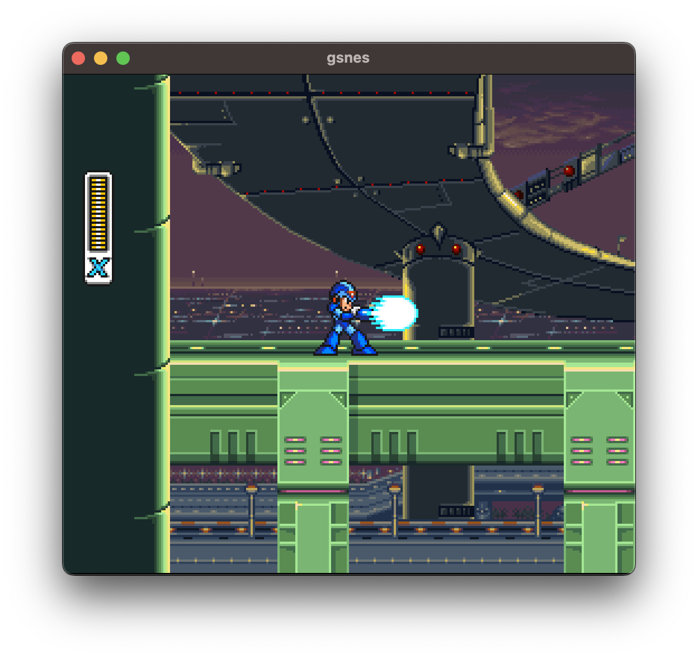
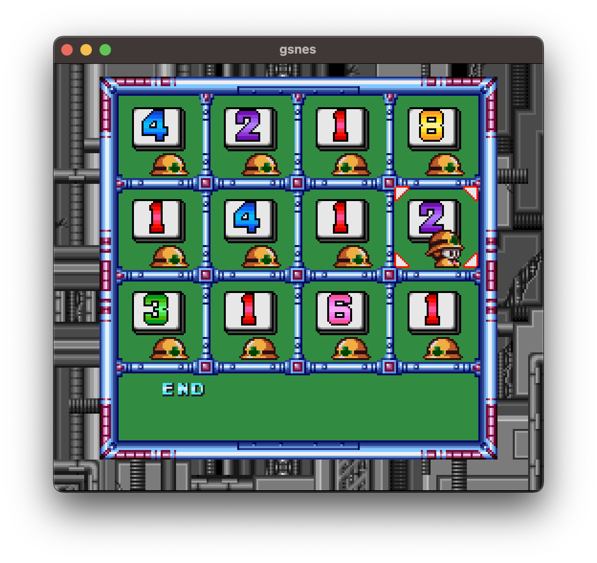
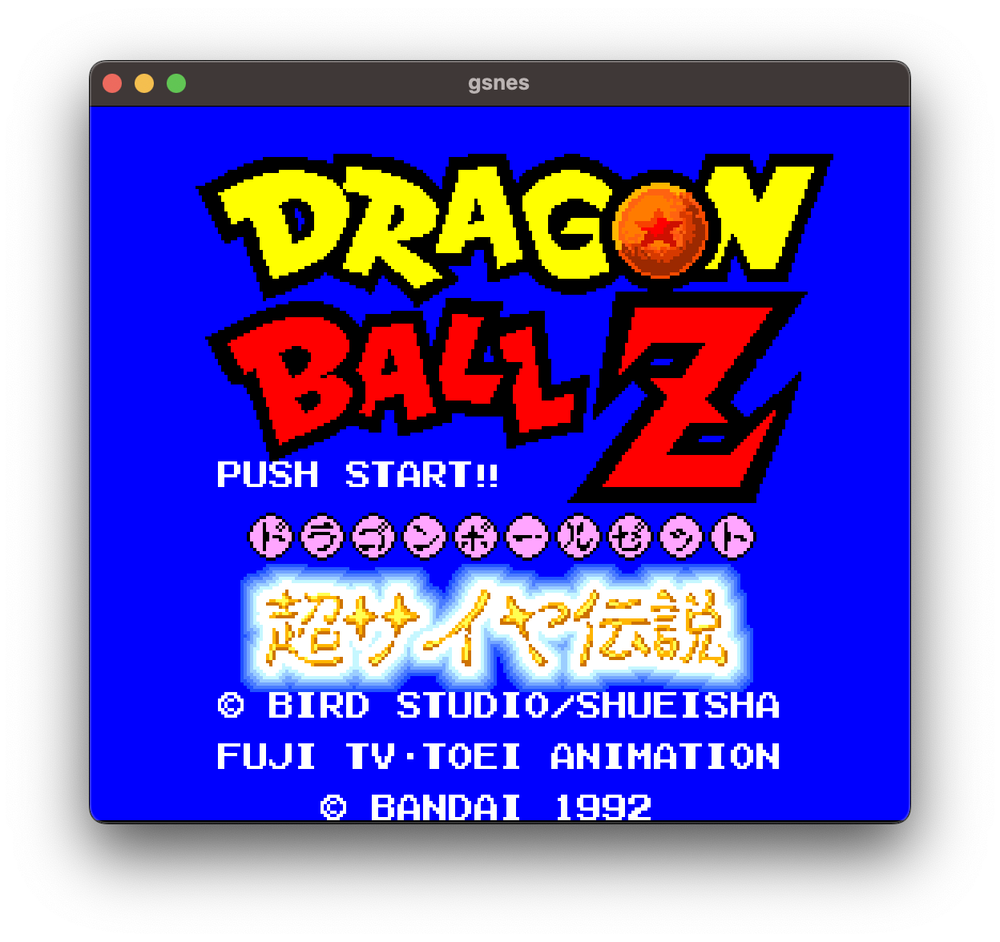
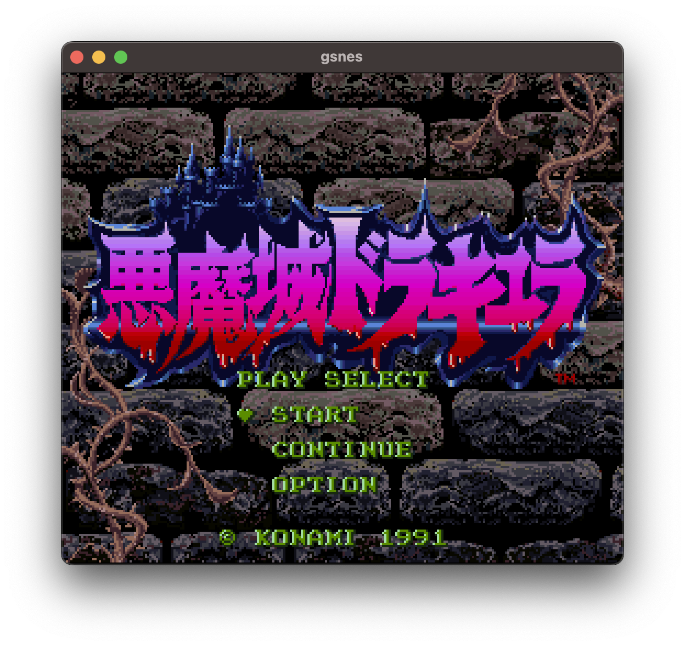

# gsnes

>**Warning**  
> This repository is work in progress, so few games are playable on this emulator.

A toy SNES emulator written in Go.

 <br/>
 

## Usage

```sh
> gh repo clone akatsuki105/gsnes
> cd ./gsnes & go run ./cmd ROMPATH.sfc
```

## Key

| input                | keyboard             |
| -------------------- | -------------------- |
| Left                 | <kbd>&larr;</kbd>    |
| Up                   | <kbd>&uarr;</kbd>    |
| Down                 | <kbd>&darr;</kbd>    |
| Right                | <kbd>&rarr;</kbd>    |
| A                    | <kbd>X</kbd>         |
| B                    | <kbd>Z</kbd>         |
| X                    | <kbd>S</kbd>         |
| Y                    | <kbd>A</kbd>         |
| L                    | <kbd>Q</kbd>         |
| R                    | <kbd>R</kbd>         |
| Start                | <kbd>Enter</kbd>     |
| Select               | <kbd>Backspace</kbd> |

## Todo

- More accuracy
- Sound
- Color Math
- Window
- Support many cartridge
- etc...

## Credits

[kaishuu0123/chibisnes](https://github.com/kaishuu0123/chibisnes)

```
This emulator does not have sound, but the APU is implemented.
This is because some games require the CPU to wait for the APU to process the game, and if the APU is not implemented, the game will hang up.
Therefore, as a temporary APU, we transplanted the chibisnes's one.
```

## References

- [Fullsnes](https://problemkaputt.de/fullsnes.htm)
- [W65C816S](https://www.westerndesigncenter.com/wdc/documentation/w65c816s.pdf)
